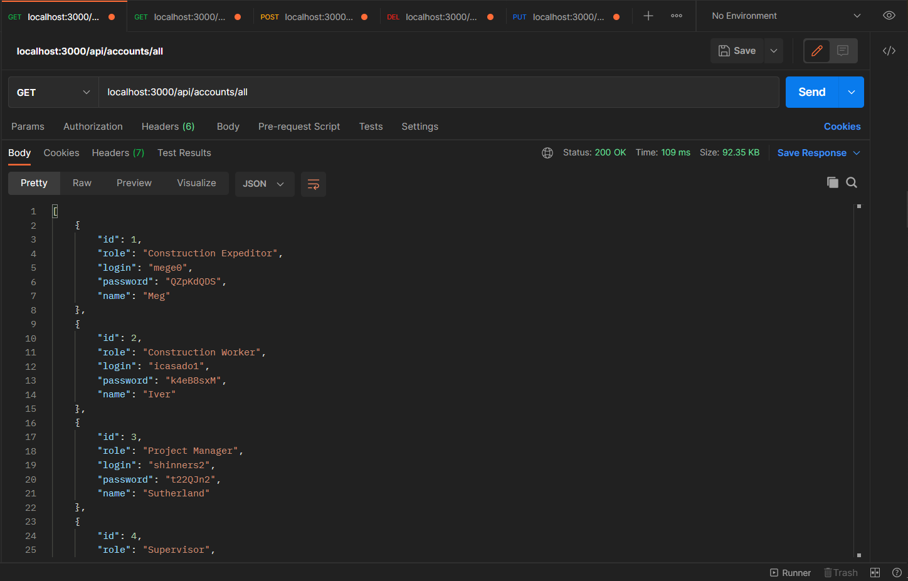
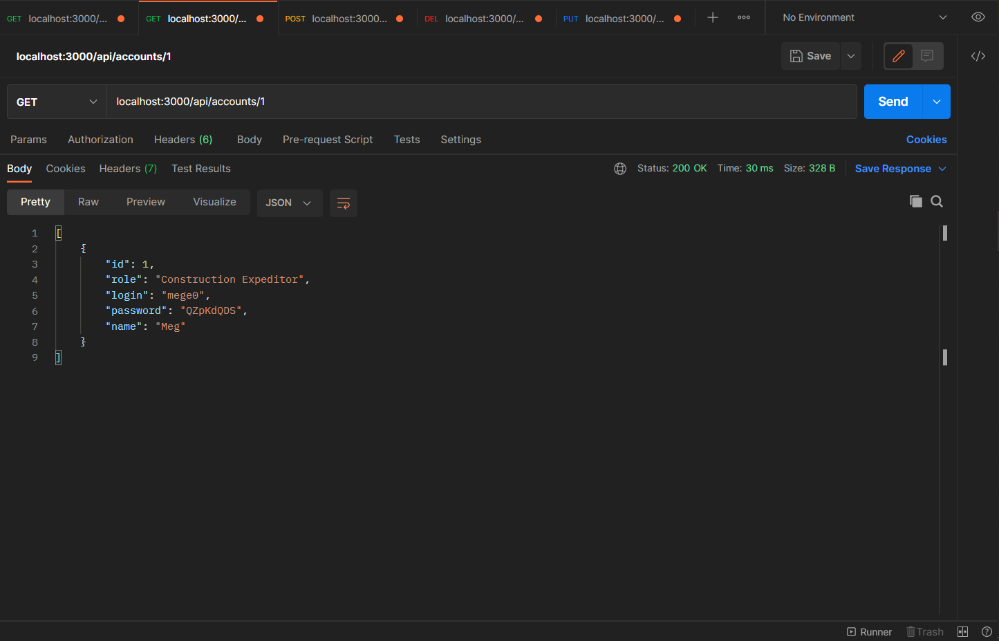
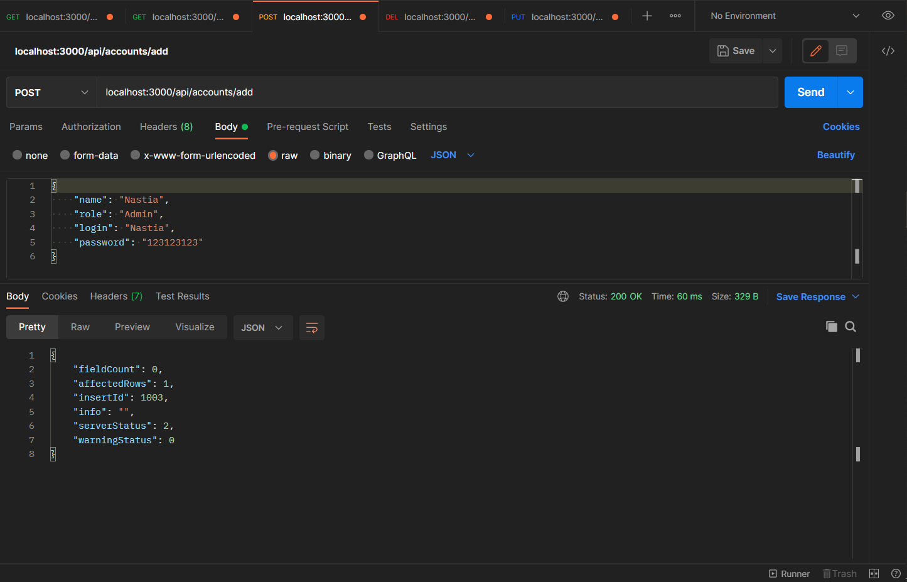
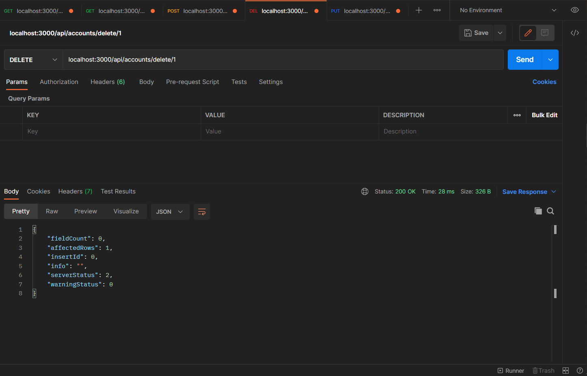
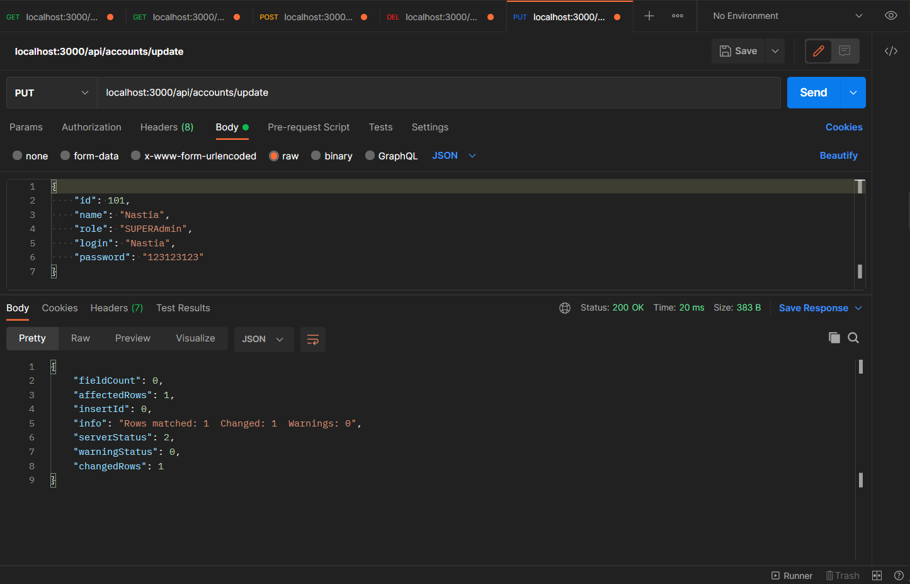
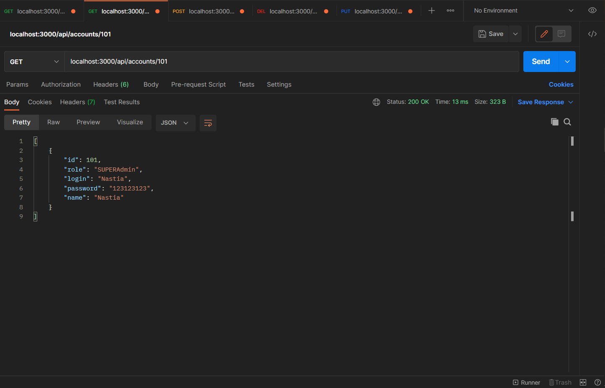

# Тестування працездатності системи
- `/api/accounts/all` - Отримати списоок всіх користувачів

- `/api/accounts/:id` - Отримати акаунт за його ID

- `/api/accounts/add` - Додати акаунт

- `/api/accounts/delete/:id` - Видалити акаунт

- `/api/accounts/update` - Оновити акаунт

